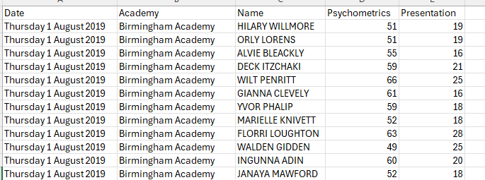
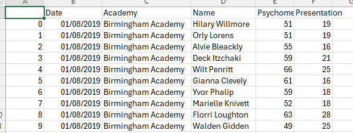

# README

## 20/08/2025

### Data cleaning 

- Connected to aws
- Got the files from bucket
- Used jupyter notebook to clean data
- Used Pandas package:
  1. capitalised only the first letter of the first name and last name
  2. Change data type for Date column (from string to datetime)
- Pushed everything on dev\enrico branch

### Before

### After 

 

## 21/06/2025

QA cleaned_talent_decision_scores.csv

- Drafted Talent data in an ERD

