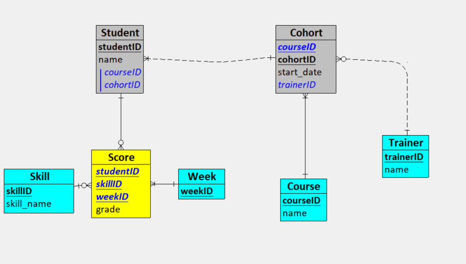
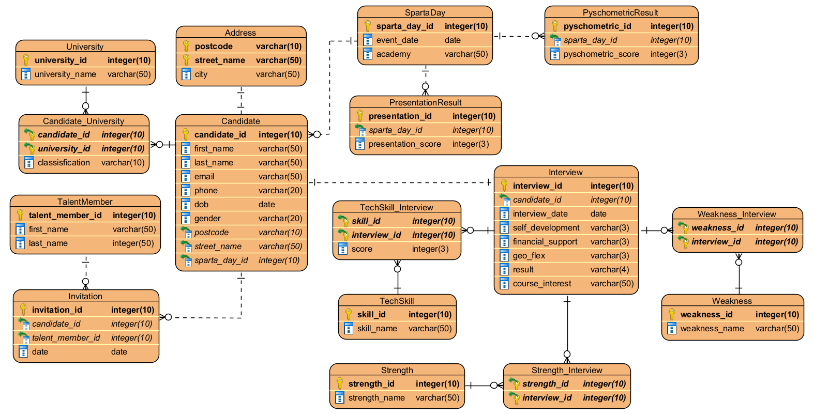
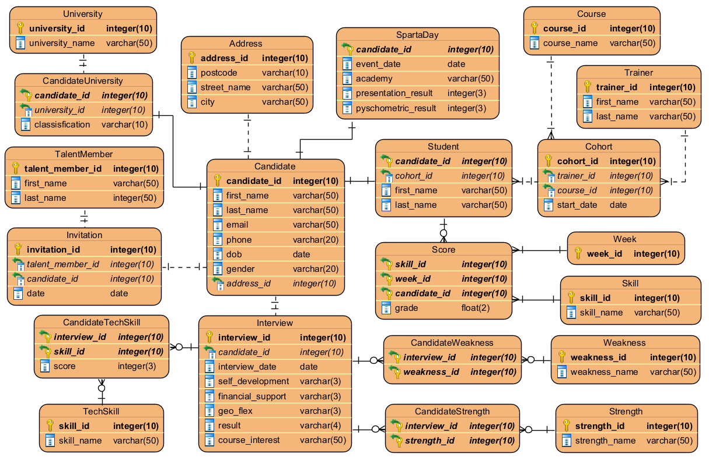

# ETL Project

---

## Project Background

This project was devised by Luke Fairbass of Sparta Global for Sparta UK’s Academy and Talent data.

---

## Project Introduction

Sparta Global runs academies across different streams such as Business, Data, and Engineering. Candidate and academy information was stored in separate CSV and JSON files across folders like Academy and Talent. These contained details on applications, Sparta Day assessments, psychometric scores, training results, and talent decisions.

The problem was that the data was spread across many files, with duplicates and inconsistent formats. This made it difficult to:

- See a single candidate’s full journey from application through training.
- Compare cohorts, streams, and trainers.
- Analyse strengths, weaknesses, and technical skills across candidates.

Our task was to design and implement an ETL pipeline that would clean, standardise, and combine this data into a 3NF database schema, enabling Sparta to better analyse candidates, cohorts, and outcomes.

---

## Software being used

- Python
- Amazon S3
- SQL
- Docker
- Github
- Git
- Trello
- Calendar for Meetings
- Visual Paradigm / Looping
- Excel
- Powerpoint

---

## How to execute the program

### Virtual Environment

**For Linux:**

```bash
python -m venv .venv
source .venv/bin/activate
pip install -r requirements.txt
```

**For Windows:**

```bash
python -m venv .venv
.venv\Scripts\activate
pip install -r requirements.txt
```

To execute the program, you will need to create a .env file in the main folder. An example of the .env file in the annexe of this file. After that all that is need is to run the main file and the extract, the transformation, the initialisation and the injection of the data will be done.

```commandline
python main.py
```

---

## Entity Relationship Diagrams (ERDs)

### Academy ERD:



### Talent ERD:

The ERD below shows the normalised schema for the Talent data.



### Combined ERD

This diagram shows the fully normalised, final data model combining both the Talent and Academy sides of the pipeline.



---

## Tools

You can install the dependencies with:

```bash
pip install -r requirements.txt
```

## Annexes

### ENV Template

Create a .env file with these parameters to connect to your mysql database

```
DB_DRIVER=
DB_SERVER=
DB_DATABASE=
DB_USER=
```

## Credits

[Martyna]() - Product Owner <br>
[Firdaws](https://github.com/FirdawsYasmin) - Scrum Master <br>
[Noor](https://github.com/Hunzaa) <br>
[Enrico](https://github.com/EnricoEmanuelObeng) <br>
[Luke](https://github.com/LukeLondesbrough) <br>
[Mahdi]() <br>
[Xavier](https://github.com/xavierfrancis1981) <br>
[Kyle](https://github.com/kgodwinb44) <br>
[Jesi](https://github.com/11kainani) <br>

---
