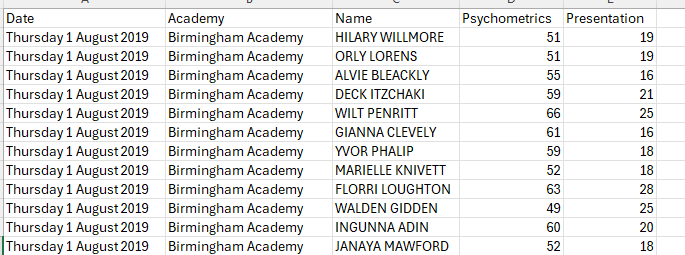
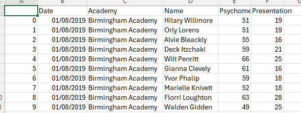
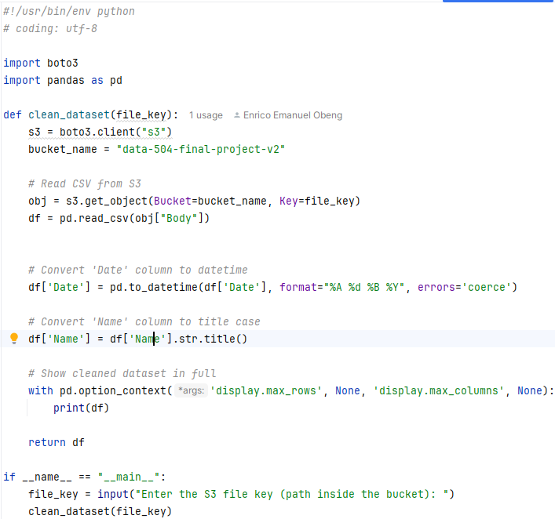
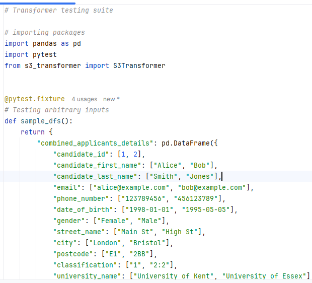
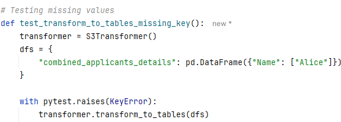
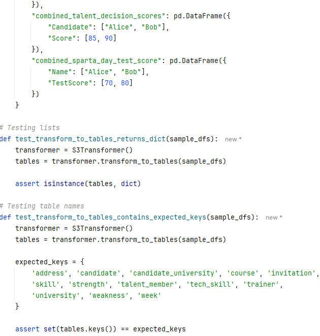
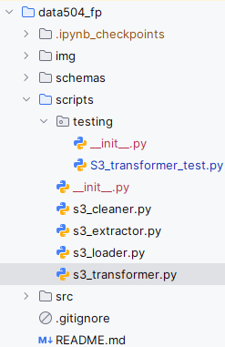
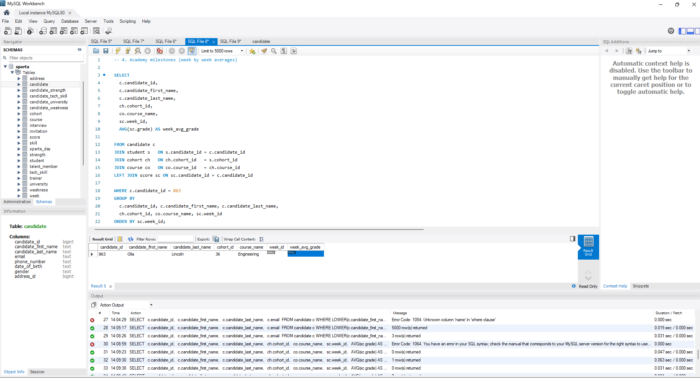

# README

## 20/08/2025

### Data cleaning 

- Connected to aws
- Got the files from bucket
- Used jupyter notebook to clean data
- Used Pandas package:
  1. capitalised only the first letter of the first name and last name
  2. Change data type for Date column (from string to datetime)
- Pushed everything on dev\enrico branch

### Before

### After 

 

## 21/08/2025

QA cleaned_talent_decision_scores.csv

- Drafted Talent data in an ERD

 

## 22/08/2025

- Creating scripting to get data from S3

 

## 26/08/2025

- Started working on testing other people code
- Building testing cases suites

 

## 27/08/2025

- More testing and spotting errors from the scripts 
  - cleaner and transformer especially
- Sorting out GitHub pull requests and merge conflicts

 

## 28/08/2025

- Finalising presentation slides
- - Doing a few queries
- Working on making the demo work

